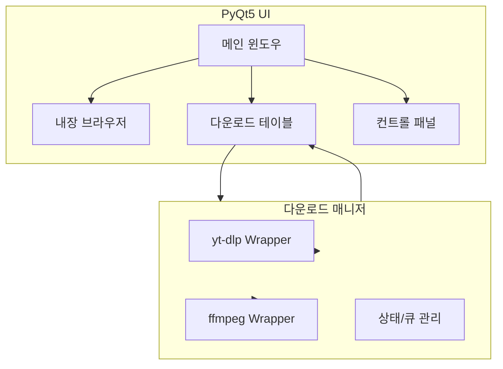

<!-- LOGO & TITLE -->
<p align="center">
  
</p>

<h1 align="center">
  Youtify 
  <br>
  <sub>Youtube, Youtube Music 다운로드를 위한 오픈소스 미디어 툴</sub>
</h1>

<p align="center">
  <a href="https://github.com/octxxiii/youtify/actions"></a>
  
  
  
  
  
</p>

---

# 🚀 프로젝트 동기

> 🎯 **Youtify**는 기존 미디어 다운로드 환경의 비효율성과 불편함을 해소하기 위해 시작된 오픈소스 데스크탑 앱입니다.

---

- 🛑 **광고, 복잡한 절차, 불필요한 클릭, 신뢰할 수 없는 사이트**  
  사용자는 안전하고 효율적인 다운로드 경험을 얻기 어려웠습니다.

- 🔒 **유튜브 API의 정책 변화와 제한, 공식 API의 불안정성, 잦은 차단**  
  기존 다운로드 도구들이 자주 동작하지 않거나, 유지보수가 어렵다는 한계가 있었습니다.

- 🧭 **내장 브라우저 기반 설계**  
  실제 사용자가 직접 접속하는 것과 동일한 환경을 제공하여, 유튜브 API를 사용하지 않고도 안정적으로 영상을 탐색·다운로드할 수 있습니다.

- 🛡️ **API 우회 및 차단 회피, 최신 UI/UX 반영, 다양한 플랫폼(유튜브, 유튜브 뮤직) 통합 지원**  
  여러 장점을 제공합니다.

- 🤝 **누구나 신뢰할 수 있는 오픈소스 미디어 다운로드 환경 제공**  
  이것이 Youtify의 목표입니다.

---

## 📋 프로젝트 개요

|  |  |
|---|---|
| **📝 프로젝트명** | Youtify |
| **✨ 주요 기능** | 유튜브/유튜브 뮤직 다운로드, 내장 브라우저, 테마, 실시간 상태 표시 |
| **💻 지원 OS** | Windows, macOS |
| **🛠️ 주요 기술** | Python 3.11+, PyQt5, PyQtWebEngine, yt-dlp, ffmpeg |
| **🪪 라이선스** | MIT |
| **👤 개발자** | OctXXIII (kdyw123@gmail.com) |

---

## 🌟 주요 기능

- 🎬 **유튜브/유튜브 뮤직 통합 다운로드**  
  영상, 음원, 플레이리스트를 한 번에 다운로드.  
  품질(음질/화질) 선택, 파일명/경로 지정, 중복 파일 자동 건너뛰기 등 다양한 옵션 제공

- 🌐 **내장 브라우저**  
  앱 내에서 직접 탐색·재생·다운로드.  
  URL 복사/붙여넣기, 홈/이전/다음/새로고침 등 기본 탐색 지원.  
  유튜브 API를 사용하지 않아 차단에 강함

- ⏱️ **실시간 상태/진행률 표시**  
  다운로드, 검색, 에러 등 모든 상태를 실시간으로 확인.  
  진행률 바, 상태 메시지, 완료 알림 등 제공

- 🎨 **테마 및 커스텀 테마**  
  12종 이상의 기본 테마와 사용자 정의 테마 지원.  
  UI 색상, 버튼 스타일, 폰트 등 다양한 요소 변경 가능

- 📋 **테이블 기반 목록 관리**  
  다운로드 대상을 테이블에서 한눈에 관리, 드래그 앤 드롭으로 순서 조정.  
  제목/경로 수정, 포맷 선택, 체크박스 선택/삭제 가능

- 🧩 **플레이리스트 지원**  
  전체/선택 다운로드, 중복 파일 자동 건너뛰기

- 🖥️ **일관된 UI/UX**  
  버튼 크기 통일, 창 최소화, 상태창 메시지 등 직관적이고 일관된 사용자 경험

- 🔓 **오픈소스 신뢰성**  
  MIT 라이선스, 누구나 소스코드 검토 및 기여 가능

---

## 💡 활용 팁

- 🔗 **URL 복사/붙여넣기**  
  브라우저에서 원하는 영상/음악의 URL을 복사해 입력창에 붙여넣으면 바로 검색 및 다운로드

- 🎚️ **포맷 선택**  
  각 영상/음원별로 원하는 포맷(음질/화질) 선택 가능

- ✏️ **제목/경로 수정**  
  다운로드 전 테이블에서 제목과 저장 경로 직접 수정

- 📥 **여러 개 동시 다운로드**  
  체크박스로 여러 영상을 한 번에 다운로드

- 🪧 **상태창 활용**  
  다운로드 진행 상황, 에러, 완료 메시지 실시간 확인

---

## 🧩 기능별 지원 현황

| 기능                | 지원 | 상세 설명                                                         |
|---------------------|:----:|-------------------------------------------------------------------|
| 🎬 유튜브 다운로드     |  ✅  | 영상/음원/플레이리스트, 다양한 포맷 선택, 제목/경로 수정 가능     |
| 🎵 유튜브 뮤직         |  ✅  | 내장 브라우저, 컨트롤, 다운로드                                    |
| 🎨 테마                |  ✅  | 12종 이상, 커스텀 테마 지원                                       |
| ⏱️ 실시간 상태/진행률  |  ✅  | 다운로드/검색/에러 모두 실시간 표시                               |
| 📋 플레이리스트 지원   |  ✅  | 전체/선택 다운로드, 중복 파일 자동 건너뛰기                        |
| 🌐 다국어              |  ❌  | (예정)                                                           |
| 📱 모바일              |  ❌  | (계획)                                                           |
| 🔄 자동 업데이트       |  ❌  | (계획)                                                           |

---

## ⚡️ 다운로드/검색 속도 벤치마크

| 도구           | 소요 시간(초) |
|----------------|:------------:|
| **Youtify**    |      72      |
| yt-dlp CLI     |      70      |
| 경쟁 GUI 툴    |     150      |

- **Youtify**는 yt-dlp 최신 엔진을 활용하여 CLI 수준의 다운로드 속도를 제공합니다.
- UI 반응성, 포맷 선택 편의성 등에서 경쟁 GUI 툴 대비 우수한 사용자 경험을 제공합니다.
- 대용량 플레이리스트, 고화질 영상 등도 안정적으로 처리할 수 있습니다.

---

## 🏗️ 아키텍처 다이어그램



- **UI**: PyQt5 기반의 반응형 인터페이스, 내장 브라우저, 테마 지원, 실시간 상태 표시
- **Core**: yt-dlp/ffmpeg 래퍼, 큐/상태 관리, 에러 핸들링, 멀티스레드 다운로드

---

## 🛠️ 설치 및 실행

### 1️⃣ 필수 요구사항
- 🐍 Python 3.11 이상
- 🧰 pip, git, ffmpeg 설치 필요
- 🆕 (권장) 최신 yt-dlp, PyQt5, PyQtWebEngine

### 2️⃣ 설치 방법

```bash
# 저장소 클론
git clone https://github.com/octxxiii/youtify.git
cd youtify

# 가상환경 생성 및 활성화
python -m venv venv
source venv/bin/activate  # Windows: venv\Scripts\activate

# 의존성 설치
pip install -r requirements.txt

# 실행
python youtify.py
```

### 3️⃣ ffmpeg 설치 예시
- 🍏 **macOS**: `brew install ffmpeg`
- 🪟 **Windows**: [ffmpeg 공식 사이트](https://ffmpeg.org/download.html)에서 다운로드 후 환경변수 등록

### 4️⃣ 실행 환경 및 권장 설정
- 🍏 **macOS**: 보안 정책으로 인해 실행이 제한될 수 있으니 FAQ 참고
- 🪟 **Windows**: ffmpeg 경로가 PATH에 포함되어 있는지 확인
- 🖥️ **고해상도/다중 모니터**: 앱 창 크기 및 DPI 설정을 조정해 최적화 가능

---

## ⌨️ 단축키

| 동작         | 단축키         | 설명                                  |
|--------------|----------------|----------------------------------------|
| 🔍 URL 검색     | Enter          | URL 입력 후 Enter로 바로 검색          |
| 🗕 창 최소화    | Esc            | 앱 창을 최소화                        |
| 🎨 테마 변경    | Ctrl+T (예정)  | 다양한 테마 간 빠른 전환               |
| ✅ 전체 선택    | Ctrl+A         | 테이블 내 모든 항목 선택               |
| ❌ 삭제         | Delete         | 선택 항목 삭제                         |

---

## ⏳ 다운로드 예상 소요시간 계산식

> **예상 소요시간**: \( T = \frac{파일\ 크기\ (MB)}{다운로드\ 속도\ (MB/s)} \)

---

## 🔒 보안 및 프라이버시

- 🖥️ Youtify는 **로컬 환경**에서만 동작하며, 사용자의 다운로드 기록이나 개인정보를 수집하지 않습니다.
- 🔄 모든 다운로드 및 변환 작업은 사용자의 PC에서만 처리됩니다.
- 🪪 오픈소스 라이선스(MIT) 기반으로, 소스코드 전체가 공개되어 있습니다.

---

## 🤝 커뮤니티 및 지원

- 💬 **이슈/PR/Discussion**: 버그 리포트, 기능 제안, 질문 등은 GitHub 이슈/PR/Discussion을 통해 자유롭게 남겨주세요.
- 📚 **문서 및 예제**: 설치, 사용법, 테마 커스터마이징 등 다양한 예제와 문서를 지속적으로 추가할 예정입니다.
- 🏅 **기여자 명단**: 주요 기여자는 README 하단 Contributors 섹션에 자동 표기됩니다.

---

## 🗺️ 향후 계획

- 🌍 다국어(영어/일본어 등) 지원
- 📱 모바일/태블릿 대응 UI
- 🔄 자동 업데이트 기능
- 📝 고급 다운로드 옵션(자막, 챕터, 썸네일 등)
- 🧩 커스텀 플러그인 시스템
- 🎨 커뮤니티 테마 마켓

---

## 🏷️ 상태 및 배지


---

## 🪪 라이선스

MIT License  
자유롭게 사용, 수정, 배포 가능. 저작권 및 라이선스 고지 필요.

---

## 🙌 기여 안내

- 🤝 PR, Issue, Discussion을 통한 다양한 기여를 환영합니다.
- 🛠️ 코드, 문서, 번역, 디자인 등 다양한 분야에서의 참여가 가능합니다.
- 🐞 버그 리포트, 기능 제안, 문서 개선 등 다양한 피드백을 환영합니다.
- 📑 커밋 메시지, 코드 스타일, 문서 포맷 등은 기존 가이드라인을 참고해 주세요.

---

## 📬 문의

- ✉️ **이메일:** kdyw123@gmail.com
- 🐙 **깃허브:** [github.com/octxxiii/youtify](https://github.com/octxxiii/youtify)

---

## ✅ 체크리스트

- [x] 🎬 유튜브 지원 (영상/음원/플레이리스트)
- [x] 📋 플레이리스트 전체/선택 다운로드
- [x] 🎨 다중 테마 및 커스텀 테마
- [x] ⏱️ 실시간 상태/진행률 표시
- [x] 🌐 내장 브라우저 기반 탐색/다운로드
- [x] 🖥️ 다운로드/삭제 버튼 크기 통일
- [x] 🗕 창 최소화/상태창 메시지
- [ ] 📱 모바일 지원(예정)

---

## ❓ 자주 묻는 질문(FAQ)

<details>
<summary><b>🍏 Q. macOS에서 실행이 안 됩니다.</b></summary>
A. 터미널에서 <code>xattr -d com.apple.quarantine ~/다운로드/Youtify</code> 명령을 실행해 주세요. macOS의 보안 정책으로 인해 서명되지 않은 앱 실행이 제한될 수 있습니다.
</details>

<details>
<summary><b>🛡️ Q. 바이러스 오탐지 경고가 발생합니다.</b></summary>
A. 오픈소스 빌드 특성상 일부 백신 프로그램이 오탐지할 수 있습니다. 소스코드와 빌드 스크립트는 모두 공개되어 있으니, 직접 빌드하여 사용하실 수 있습니다.
</details>

<details>
<summary><b>🧭 Q. 내장 브라우저에서 일부 컨트롤이 동작하지 않습니다.</b></summary>
A. QWebEngine의 보안 정책 및 Shadow DOM 등 기술적 한계로 인해 일부 사이트에서 컨트롤이 제한될 수 있습니다. 이는 크로스플랫폼 데스크탑 앱의 공통적인 한계입니다.
</details>

<details>
<summary><b>🎨 Q. 커스텀 테마 또는 플러그인을 추가하고 싶습니다.</b></summary>
A. <code>themes/</code> 폴더에 테마 파일을 추가하거나, 다운로드 매니저 모듈을 확장할 수 있습니다. 자세한 내용은 문서와 예제 코드를 참고하세요.
</details>

---

<p align="center"><b>Youtify는 신뢰할 수 있는 오픈소스 미디어 다운로드 환경을 제공합니다.</b></p>
